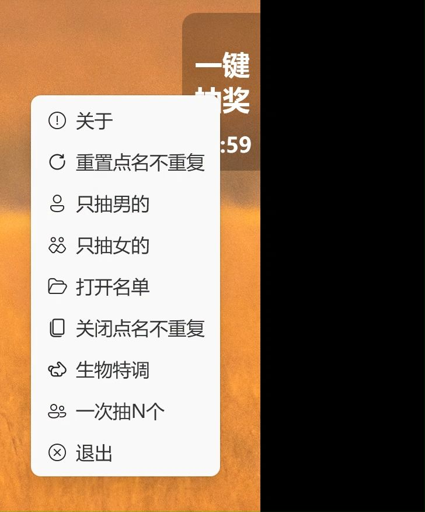
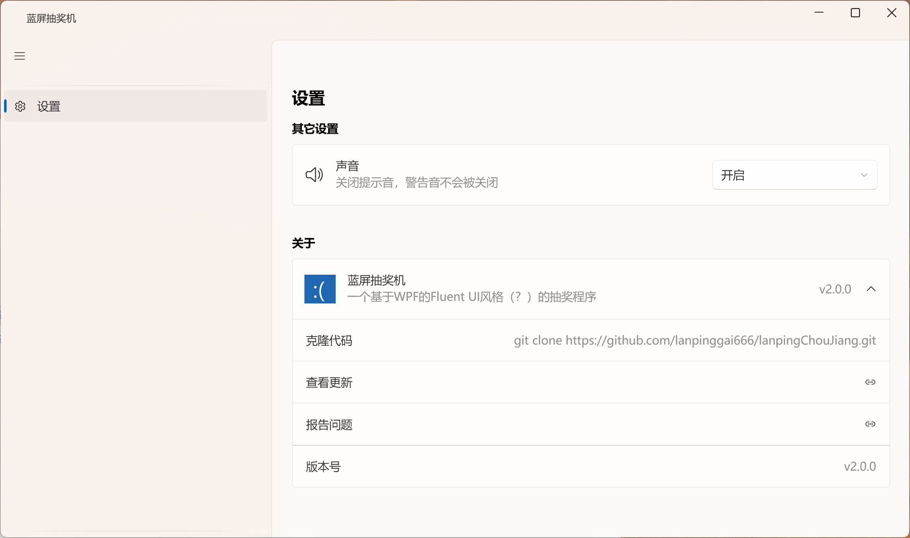

# 蓝屏抽奖机
**一个置顶在屏幕左侧中间方便老师在上课时点名的程序（你用来抽奖也行）。是鄙人的第一个作品。 
使用WPF编写，拥有（伪）Fluent UI风格。运行需要.NET 8.0运行库。（虽然不知道这么简单的程序要运行库，但我真的不会其 
他的啊😭😭😭）**
## Furters
**✅点名 
✅只点女生 
✅只点男生 
✅点名不重复 
✅一次点N个 
✅其他小功能 
~~❌特调~~（永远不会支持影响平衡的功能）**
## 已知~~Bug~~特性
**1.由于本人实力和实用性问题，点名不重复不支持超过100人。 
~~2.在某些常规应用（如安道白板）中无法置顶（好像是它们的置顶等级更高？）~~（已解决） 
3.更多问题等你发现！（欢迎提Issue！）**
## 样式
当它启动时，它会以这样的方式躺在你的屏幕上 
 
当你点击它时，它会弹出一个框框 
 
当你右击它时，它会伸出一个菜单（生物特调是为了适应我们班的情况，发行版没有～） 
 
当你点击关于时，它就会弹出一个窗口，，，里面可以设置一些东西 
别问我为什么不叫设置，因为历史遗留。
 
## 其他
### 为什么叫蓝屏点名器
**~~因为本人水平低，代码写得稀烂。因为太多Bug导致使用本软件会导致你的电脑蓝屏。~~** 
**因为我叫蓝屏钙啊！**
###使用的其他开源项目
**1.[WPF UI](https://github.com/lepoco/wpfui)  使用的协议：MIT license。 
2.[Fluent UI System Icons](https://github.com/microsoft/fluentui-system-icons) 使用的协议：MIT license。 
以及其它未列举出来的。 
已经遵守各个开源项目的协议！ **
### 给我点Star！！！
