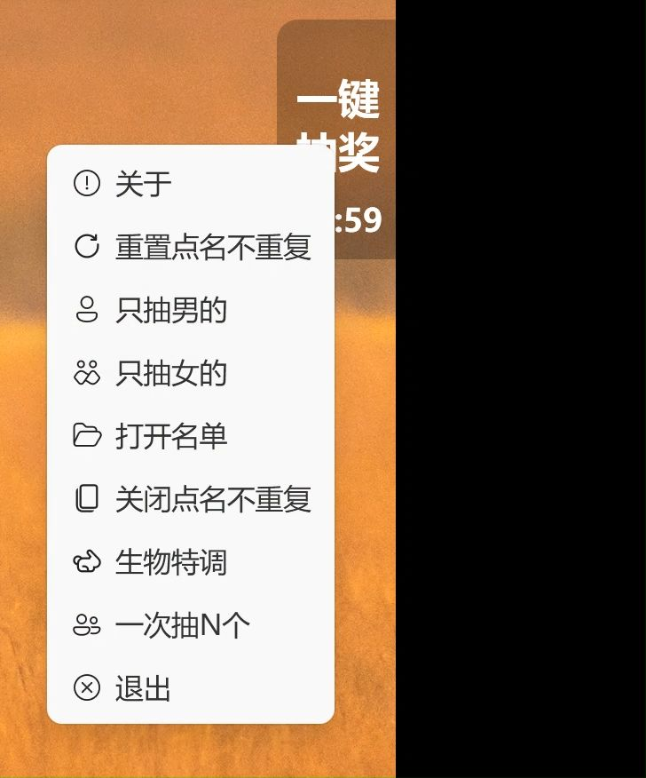
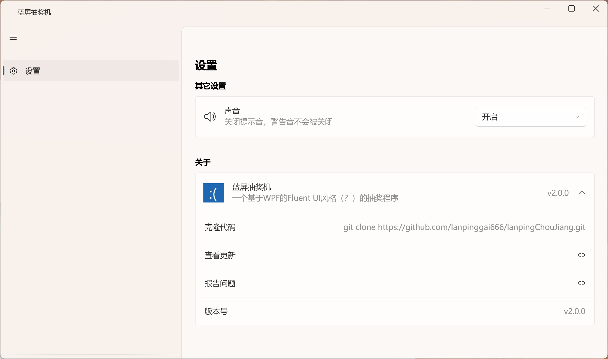

# 蓝屏抽奖机 (lanpingChouJiang)

一个专为课堂点名与随机抽奖设计的轻量级桌面工具。程序默认置顶于屏幕左侧中央，方便教师在授课时随时调用。本项目为作者的首个独立开源作品。

---

## 简介

本项目基于 **WPF (.NET 8.0)** 框架开发，界面采用现代理念的伪 **Fluent UI** 风格。由于采用现代 .NET 架构，运行计算机需安装 `.NET Desktop Runtime 8.0` 环境。

---

## 核心特性 (Features)

* **抽奖**：抽奖。
* **只抽男/女**：支持“只抽男生”或“只抽女生”。
* **点名不重复**：开启后，已被抽中的人员在重置前不会再次出现。
* **一次抽N个**：支持单次单抽或单次批量抽取 N个目标。
* ~~**特调**~~：不提供任何影响随机性与公平性的定制功能。

---

## 已知问题与特性 (Known Issues)

1.  ~~**人数限制**：受限于当前底层逻辑设计，不重复点名功能目前最大支持 **100 人**~~（？忘记有没有这个限制了）。
2.  ~~**白板软件覆盖问题**：在部分常规教学应用（如希沃/安道白板）中无法置顶。~~ *(已于新版本中修复)*
3.  **其他问题**：欢迎提交 [Issue](https://github.com/lanpinggai666/lanpingChouJiang/issues) 帮助我们完善程序。

---

## 界面预览 (Screenshots)

### 1. 悬浮窗状态

### 2. 主抽奖界面

### 3. 右键菜单

### 4. 设置与关于

---

## 常见问题 (FAQ)

### 为什么叫“蓝屏抽奖机”？

> 因为开发者水平有限，经常因代码漏洞导致程序崩溃，会使你的设备蓝屏（bushi

---

## 鸣谢与开源协议

本项目严格遵守相关开源项目的协议规范，并对以下项目表示感谢：

1.  [WPF UI](https://github.com/lepoco/wpfui) — 遵循 **MIT License**。
2.  [Fluent UI System Icons](https://github.com/microsoft/fluentui-system-icons) — 遵循 **MIT License**。

如果你觉得这个项目对你有帮助，欢迎为本项目点一个 **Star** 🌟！
